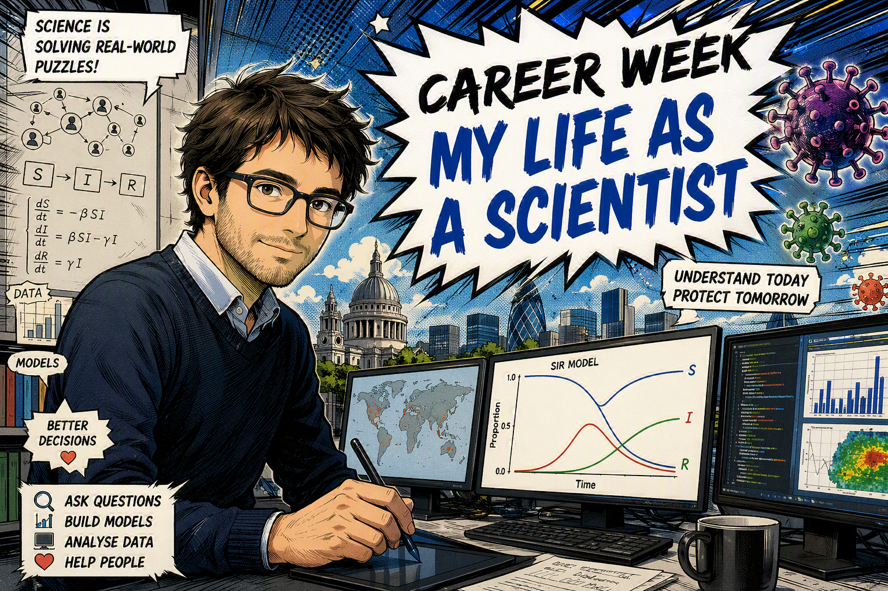
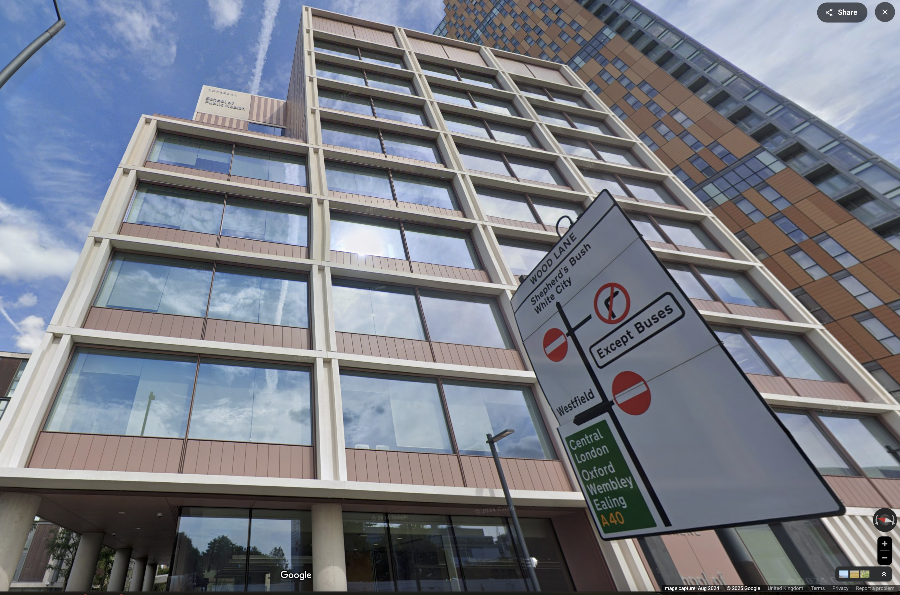
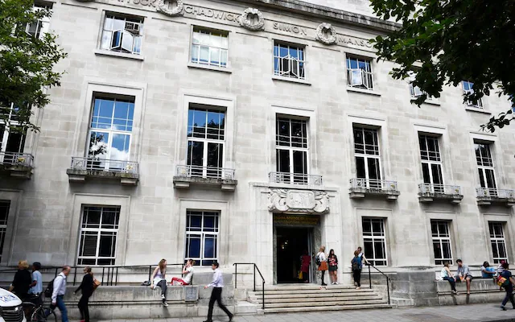

# {.center background-image="figs/title.png"}

<!-- {width=100%} -->

## My job: Associate Professor

:::: {.columns}

::: {.column width="60%"}

- Epidemiologist → understanding how diseases spread

- Imperial College London

- London School of Hygiene & Tropical Medicine

:::

::: {.column width="40%"}

{width=80%}

\vspace{1em}

{width=80%}

:::

::::

## Who am I?

🇫🇷 Born in France

🇬🇧 Moved to the UK

❤️ Maths

💻 Computers

🔬 Science

🤝 Helping people

## Can diseases spread like dominoes?

😷 → 😷 → 😷 → 😷

Can we predict what happens next?

That's my job!

## Scientists are detectives {.smaller}

:::: {.columns}

::: {.column width="45%"}

{width=100%}

:::

::: {.column width="55%"}

❓ We can't see infections happen

 

So we look for clues:

🦠 Tests

📈 Data

🏥 Hospitals

💻 Computers

::: fragment

 

### We use clues to solve the mystery.

:::

:::

::::

# Two examples of my work {background-image="figs/background1.png"}

## 🦠 → 🌍 → 🤝 → 🏥 → 💉 → 😊

::: fragment
During Covid 19, scientists worked together.
:::

::: fragment
Doctors, nurses, engineers and researchers.
:::

::: fragment
I built mathematical models to explore what might happen next and advise the government.
:::

## Who has had the little nose spray? {.smaller}

👦

↓

👦 👧 👦 👧

↓

🏠 Families

↓

👵 Grandparents

 

::: fragment
Children are very good at sharing germs like influenza!
:::

::: fragment
Vaccinating one person helps protect many others.
:::

::: fragment
My work helped provide scientific evidence used by experts when considering the UK's school flu programme.
:::

---

## What is a mathematical model?

### Like Minecraft 🎮

### Like weather forecasts ☀️

::: fragment
A model is a simulator.
:::

::: fragment
A practice world for testing ideas safely.
:::

---

## Let's imagine...

🔴 = infected

🔵 = healthy

🟢 = vaccinated

 

🔵 🔵 🔴 🔵 🔵

::: fragment
What happens next?
:::

::: fragment
Can you guess?
:::

## Let's model it... {.smaller}

🔴 = infected

🔵 = healthy

🟢 = vaccinated

 

🔵 🔵 🔴 🔵 🔵

::: fragment
What happens next?
:::

::: fragment
Maybe the infected person passes the infection to one of their neighbours...
:::

::: fragment
🔵 🔴 🔴 🔵 🔵
:::

::: fragment
Then the process repeats.
:::

::: fragment
🔴 🔴 🔴 🔵 🔵
:::

::: fragment
This simple idea is the basis of many infectious disease models.
:::

## Let's imagine...

🔵 🟢 🔴 🔵 🔵

::: fragment
Can the infection spread to everyone?
:::

::: fragment
🟢 individuals are protected.
:::

::: fragment
They can block transmission.
:::

::: fragment
Vaccination protects individuals...
:::

::: fragment
...and can protect others too.
:::

## Comparing the two scenarios

:::: {.columns}

::: {.column width="50%"}
No vaccination

🔴 🔴 🔴 🔵 🔵
:::

::: {.column width="50%"}
With vaccination

🔵 🟢 🔴 🔵 🔵
:::

::::

 

Vaccination changes the final outcome.

## My favourite part of my job

🧩 Solving puzzles

🌍 Helping people

👨‍💻 Building models

👩‍🔬 Working with amazing people from different disciplines

🎓 Teaching

## How did I become a scientist?

### School

↓

### Loved maths

↓

### University (engineering & applied maths)

↓

### Research UKSHA and Imperial and LSHTM

::: fragment
I wasn't born a scientist.
:::

## Your turn!

### What would YOU investigate?

🌍 Climate change?

✨ The stars and planets?

🦖 Dinosaurs?

🦠 Diseases?

🏺 History and ancient civilizations?

## Thank you!

🟨 Stay curious.

🟦 Keep asking questions.

🟩 Science needs people like you.

🟪 Anyone can become a scientist.

## Time for an animation!


